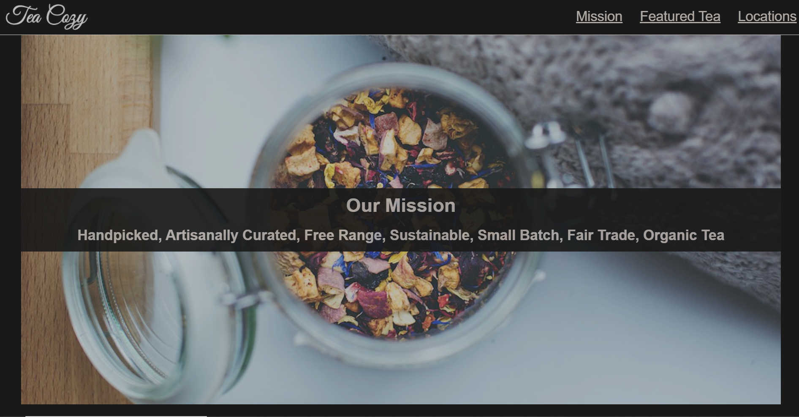

# Project: Tea Cozy
#### The aim of the project: to create a fictional tea shop website, using a provided design spec
## Table of contents:
* [General info](#general-info)
* [Technologies](#technologies)
* [Screenshot](#screenshot)
* [Launch](#launch)
* [Sources](#sources)

## General info:
* This project is a part of Codecademy Full-Stack Engineering Path

## Technologies:
* HTML
* CSS
* Markdown
* Git
* GitHub
* Visual Studio Code 1.63.0

## Screenshot:

## Launch:
Click on [the link](https://20dom21.github.io/teacozy/).

## Sources:
https://content.codecademy.com/courses/freelance-1/unit-4/img-tea-cozy-redline.jpg

